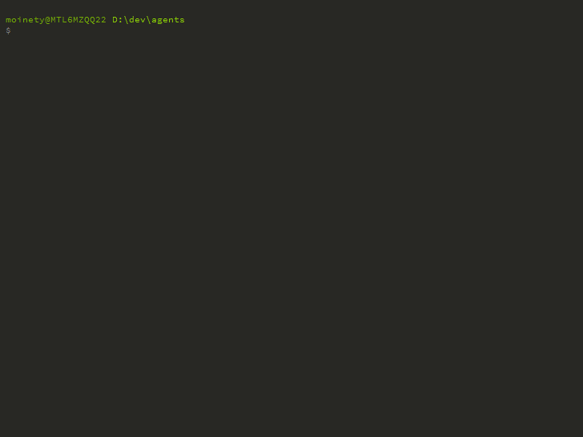

# agent

> Bots navigating urls and doing tasks.



`agent` is a CLI that runs on [CasperJS](http://casperjs.org/) which runs on [PhantomJS](http://phantomjs.org/).

It feeds on JSON files that describe what tasks it needs to achieve on specified starting URL.

```bash
Usage:
  agent [OPTIONS] [COMMAND]

Commands:
  run <files...>  Run the list of JSON tasks files. Accept glob.

Options:
   -h, --help     output usage information
   -V, --version  output the version number
```

## Installation

### Locally

If you want to use it locally in your project, to automatically test your builds for example.
It can be added manually in your `package.json` as :

```javascript
"devDependencies": {
    "agent": "git://git.autodesk.com/CICD/agent"
}
```

### Globally

Or you can install it globally :

```bash
> git clone git@git.autodesk.com:CICD/agent.git
> cd agent
> npm link
```

Because it's not yet available on `npm`.

## Usage

### Locally

```node
var agent = require('agent');
agent.start('./tasks.json');
```

### Globally

```bash
> agent run tasks.json
or
> agent run tasks1.json tasks2.json
or 
> agent run *.json
```

## Task File

### `config`

Your task file must have a `config` entry with a `size` and a `url`.

```javascript
"config": {
    "size": {
        "width": 1024,
        "height": 768
    },
    "url": "http://www.google.ca"
}
```

- `size` is for the viewport's size.
- `url` is the starting point of your agent.

### `tasks`

Then you describe your tasks in a `tasks` entry that is an array of all the tasks to achieve sequentially :

```javascript
"tasks": [
    {},
    {}
]
```

It exists four kinds of tasks that an `agent` can achieve :

#### `capture`

A simple screen capture :

```javascript
{
    "type": "capture",
    "params": {
        "name": "start.png"
    }
}
```

#### `wait`

An `agent` can wait for 5 different things.

- `url`

```javascript
{
    "type": "wait",
    "params": {
        "url": "http://www.yahoo.ca"
    }
}
```

The agent will wait at this step until this url is reached.

- `selector`

```javascript
{
    "type": "wait",
    "params": {
        "selector": "#content"
    }
}
```

The agent will wait at this step until the `selector` is available on the page.

- `visible`
- `hidden`

Both are the same as `selector` but will wait for these specific states of the element.

- `time`

```javascript
{
    "type": "wait",
    "params": {
        "time": "1000"
    }
}
```

The agent will wait for the specified amount of milliseconds.

#### `dom`

An `agent` can perform two different actions on a dom element :

- `click`

```javascript
{
    "type": "dom",
    "params": {
        "selector": "button#btnSubmit",
        "do": "click"
    }
}
```

The `agent` will click on the specified selector.

- `fill`

```javascript
{
    "type": "dom",
    "params": {
        "selector": "input#userName",
        "do": "fill",
        "text": "yoann.dev"
    }
}
```

The `agent` will enter text in the specified field.

#### `request`

An `agent` can perform an AJAX call from within its workflow.

```javascript
{
    "type": "request",
    "params": {
        "url": "https://www.google.com",
        "method": "GET",
        "payload": {
            "q": "funny cats"
        },
        "headers": {
            "header": "value"
        },
        "store": {
            "key": "key",
            "variable": "variable.attr1"
        }
    }
}
```

You can also `store` the response for later use with `{{key}}`. 

If you don't pass a `variable` it will store the complete response. 

Otherwise, it will try to parse the response as JSON and look for your variable.

#### `get`

##### _store_

An `agent` can perform two different `get` to retrieve a value and store it for subsequent tasks :

- `attribute`

```javascript
{
    "type": "get",
    "params": {
        "selector": "div#Info",
        "attribute": "title",
        "key": "infoTitle",
        "modifier": "[a-z]+" (optional)
    }
}
```

The `agent` will get the value of the `attribute`, apply the `modifier` RegExp and store it as `infoTitle`.

`@text` can also be used as an `attribute` to get the text content of the `selector`

- `variable`

```javascript
{
    "type": "get",
    "params": {
        "variable": "var.attr1['attr2']",
        "key": "varAttr2"
    }
}
```

The `agent` will access to the specified variable with `window` as the root object and store its value as `varAttr2`

##### _access_

The value can then be accessed in any following tasks via its `key` value

```javascript
{
    "type": "wait",
    "params": {
        "url": "http://www.yahoo.ca/{{key}}"
    }
}
```

To access the stored value, call the `key` in between double brackets `{{key}}`
